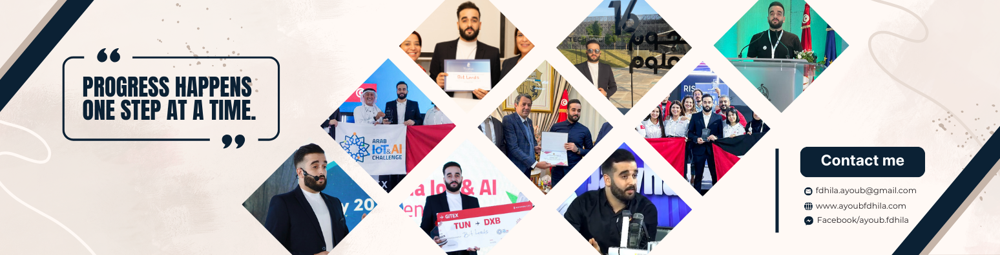

<!-- Cover Image -->

  

 

<!-- Animated Typing SVG -->

  

## 🌟 About Me

Hi, I'm **Ayoub Fdhila**. I am an **Full Stack Developer** and **AI Engineer** focused on building production-ready applications.

I don't just train models; I build the infrastructure around them. My experience spans the full lifecycle—from data engineering and model training to deployment and backend integration. I enjoy solving difficult technical problems and writing clean, maintainable code.

My work has been technically validated through competitions like **Stars of Science** and **GITEX Global**, where I demonstrated practical applications of my code.

I prefer working in collaborative teams where I can contribute to architecture decisions and learn from others.

<!-- Contact Me -->

  
  
  
  

---

## 🔭 **Who Am I?**

- 💻 **Full-Stack Developer:** I bring ideas to life with robust, scalable applications.
- 🌟 **AI/ML Enthusiast:** I thrive on pushing the boundaries of **AI** to tackle complex challenges.
- 🧩 **Innovator:** From award-winning projects to groundbreaking competitions, I'm all about creativity and impact.
- 🌱 **Continuous Learner:** When I'm not coding, I'm exploring the **latest in AI research** or honing my **entrepreneurial skills**.

---

## 🏆 Highlights & Achievements

<table>
  <tr>
    <td width="50%" valign="top">
      <h3>🎖 Awards & Competitions</h3>
    </td>
    <td width="50%" valign="top">
      <h3>🎓 Certifications</h3>
    </td>
  </tr>
  <tr>
    <td valign="top"><strong>Stars of Science</strong>: Top 10 Finalist</td>
    <td valign="top"><strong>Deep Learning Specialization</strong>: DeepLearning.AI</td>
  </tr>
  <tr>
    <td valign="top"><strong>Arab AI & IoT Competition</strong>: Third Place</td>
    <td valign="top"><strong>Data Science Professional Certificate</strong>: IBM</td>
  </tr>
  <tr>
    <td valign="top"><strong>Tunisia AI & IoT Competition</strong>: National Winner</td>
    <td valign="top"><strong>Entrepreneurship Specialization</strong>: Wharton University</td>
  </tr>
  <tr>
    <td valign="top"><strong>AI Night Challenge</strong>: First Place</td>
    <td valign="top"><strong>Machine Learning Specialization</strong>: Stanford University</td>
  </tr>
</table>

## ⚙️ Technical Toolkit

### Programming Languages

  
  
  

### Software Development

  
  
  
  
  
  
  
  
  
  

### AI/ML Frameworks

  
  
  
  
  
  
  
  
  
  

### Specialized Skills

  
  
  
  
  
  
  
  

---

<table align="center">
  <tr>
    <!-- GitHub Stats -->
    <td>
      
    </td>
    <!-- Most Used Languages -->
    <td>
      
    </td>
  </tr>
</table>
